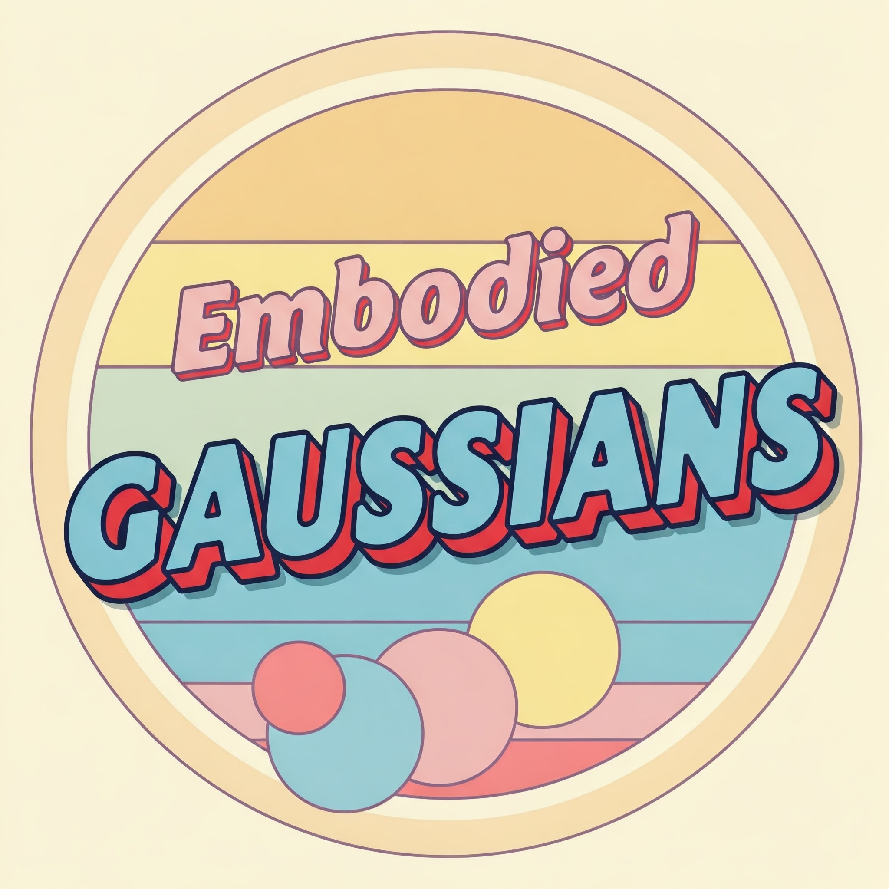

# Physically Embodied Gaussian Splatting

<div align="left" style="display: left; align-items: center; justify-content: center; gap: 20px;">
    
</div>

[Project Page](https://embodied-gaussians.github.io/) | [Paper](https://openreview.net/pdf?id=AEq0onGrN2)

## Overview

Embodied Gaussians introduces a novel dual "Gaussian-Particle" representation that bridges the gap between physical simulation and visual perception for robotics. Our approach:

- 🎯 **Unifies** geometric, physical, and visual world representations
- 🔮 Enables **predictive simulation** of future states
- 🔄 Allows **online correction** from visual observations
- 🌐 Integrates with an **XPBD physics** system
- 🎨 Renders high-quality images through **3D Gaussian splatting**

## Demo
<div align="left" style="display: left; align-items: center; justify-content: center; gap: 20px;">
    
</div>

## Abstract

For robots to robustly understand and interact with the physical world, it is highly beneficial to have a comprehensive representation -- modelling geometry, physics, and visual observations -- that informs perception, planning, and control algorithms. We propose a novel dual "Gaussian-Particle" representation that models the physical world while (i) enabling predictive simulation of future states and (ii) allowing online correction from visual observations in a dynamic world.

Our representation comprises particles that capture the geometrical aspect of objects in the world and can be used alongside a particle-based physics system to anticipate physically plausible future states. Attached to these particles are 3D Gaussians that render images from any viewpoint through a splatting process thus capturing the visual state. By comparing the predicted and observed images, our approach generates "visual forces" that correct the particle positions while respecting known physical constraints.

By integrating predictive physical modeling with continuous visually-derived corrections, our unified representation reasons about the present and future while synchronizing with reality. We validate our approach on 2D and 3D tracking tasks as well as photometric reconstruction quality.

## Implementation Notes

This repository provides a reference implementation of Embodied Gaussians with some differences from the paper:

- 🔷 **Rigid Bodies Only**: Currently, this implementation only supports rigid body dynamics. The shape matching functionality described in the paper is not included.
- 🔨 **Simplified Physics**: Due to the rigid body constraint, the physics simulation is more straightforward but less flexible than the full implementation described in the paper.

## Getting Started

### Installation

1. First, install [pixi](https://pixi.sh/latest/#installation)

2. Then build the dependencies:
```bash
pixi r build
```

### Running the Demo

To run the included demo:
```bash
pixi r demo
```

## Citation

If you find this work useful, please consider citing our paper:

```bibtex
@inproceedings{
    abouchakra-embodiedgaussians,
    title={Physically Embodied Gaussian Splatting: A Realtime Correctable World Model for Robotics},
    author={Jad Abou-Chakra and Krishan Rana and Feras Dayoub and Niko Suenderhauf},
    booktitle={8th Annual Conference on Robot Learning},
    year={2024},
    url={https://openreview.net/forum?id=AEq0onGrN2}
}
```

## More Information

For videos and additional information, visit our [project page](https://embodied-gaussians.github.io/).

